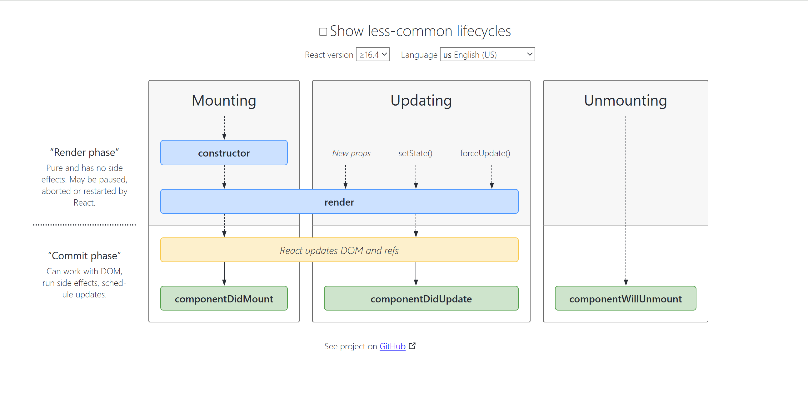

### Chapter 08 - Let's Get Classy 🚀

---

## 🔄 How do you create `Nested Routes` using `react-router-dom`?

To configure **nested routes** in React using `react-router-dom` v6+, you typically use `createBrowserRouter` along with nested `children` arrays.

### ✅ Basic Example:

```js
const router = createBrowserRouter([
  {
    path: "/",
    element: <Parent />,
    errorElement: <Error />,
    children: [
      {
        path: "path", // relative path
        element: <Child />,
      },
    ],
  },
]);
```

### 🔁 Nested within Nested:

To add another level of nested routes (e.g. `/path/child`):

```js
const router = createBrowserRouter([
  {
    path: "/",
    element: <Parent />,
    errorElement: <Error />,
    children: [
      {
        path: "path",
        element: <Child />,
        children: [
          {
            path: "child", // Avoid using '/' for nested routes
            element: <SubChild />,
          },
        ],
      },
    ],
  },
]);
```

⚠️ **Note:** Do _not_ prefix nested route paths with a slash (`/`). React Router treats `/` as the root, not relative.

---

## 🌐 `createHashRouter` vs `createMemoryRouter`

### 🔹 `createHashRouter`

- Uses the **hash** (`#`) portion of the URL to manage routing.
- Useful when the server is **not configured** to handle client-side routing.
- Example URL: `http://example.com/#/home`

📘 [Read Docs](https://reactrouter.com/en/main/routers/create-hash-router)

---

### 🔸 `createMemoryRouter`

- Manages routing history **in-memory**, not in the browser.
- Ideal for **testing**, **Storybook**, or environments without a real browser (like React Native).

📘 [Read Docs](https://reactrouter.com/en/main/routers/create-memory-router)

---

## 🔁 React Class Component Lifecycle Order

The **lifecycle methods** of a class component are called in the following order:

1. `constructor()`
2. `render()`
3. `componentDidMount()`
4. `componentDidUpdate()`
5. `componentWillUnmount()`

🎨 Visual Aid: [React Lifecycle Diagram](https://projects.wojtekmaj.pl/react-lifecycle-methods-diagram/)

---

## 🧱 Why do we use `componentDidMount()`?

- Called **after the component is mounted** (i.e., inserted into the DOM).
- Best place to **make API calls**, add event listeners, or initiate subscriptions.
- Helps in fetching data once the UI is ready.

---

## 🧹 Why do we use `componentWillUnmount()`?

- Called **just before the component is removed** from the DOM.
- Use this method to **clean up**: remove timers, unsubscribe from services, or cancel API requests.

### 🔧 Example:

```js
componentDidMount() {
  this.timer = setInterval(() => {
    console.log("Running...");
  }, 1000);
}

componentWillUnmount() {
  clearInterval(this.timer);
}
```

This prevents memory leaks by **clearing intervals** or other long-running processes when the component is no longer visible.

---

## 🔍 Why do we use `super(props)` in constructor?

- Required to **call the constructor** of the **parent class (`React.Component`)**.
- `super(props)` allows access to `this.props` inside the constructor.
- Without it, you'll get:
  ❌ `ReferenceError: Must call super constructor in derived class before accessing 'this'`.

### ✅ Example:

```js
constructor(props) {
  super(props); // enables use of this.props
  this.state = {
    name: props.name,
  };
}
```

---

## 🤯 Why can't we use `async` directly in `useEffect`?

React's `useEffect()` **should return either:**

- `undefined`, or
- a cleanup function

If you mark the callback `async`, it **returns a Promise**, which React doesn't handle as a valid return for cleanup.

### ❌ Incorrect:

```js
useEffect(async () => {
  await fetchData();
}, []);
```

### ✅ Correct Approach:

```js
useEffect(() => {
  const fetchData = async () => {
    await fetch(...);
  };

  fetchData();
}, []);
```

This ensures `useEffect` behaves as expected, without disrupting React’s cleanup mechanism.

---

## ✅ Summary

- Nested routes use the `children` property within route objects.
- `createHashRouter` and `createMemoryRouter` solve routing problems in non-standard environments.
- Class lifecycle methods offer precise control over mounting, updating, and unmounting.
- `componentDidMount()` is perfect for side effects like data fetching.
- Always clean up in `componentWillUnmount()` to prevent memory leaks.
- `super(props)` gives access to props in constructor.
- Avoid marking `useEffect`'s main callback as `async`.



---
